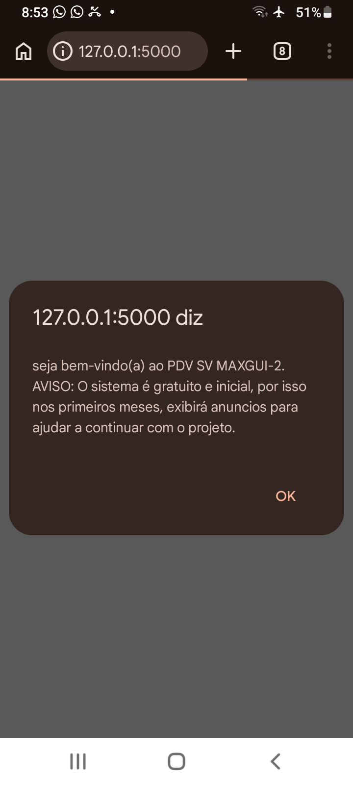
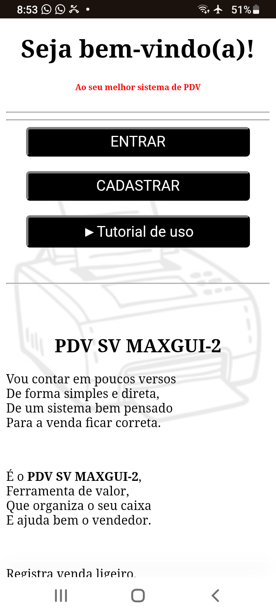
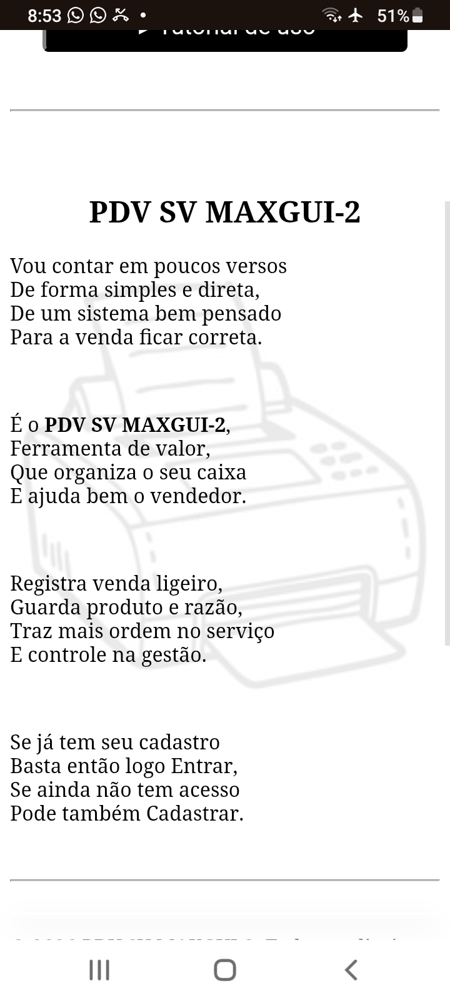
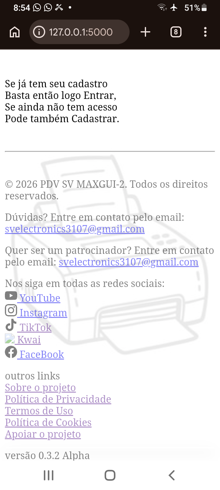

#  **PDV SV MAXGUI-2**

## 🚀 Sobre o projeto

O **PDV SV MAXGUI-2** é um sistema de ponto de venda em desenvolvimento com Flask.

O objetivo é evoluir para uma aplicação completa de gestão comercial para pequenos e médios negócios, incluindo controle de vendas, estoque e usuários.

Ele será *100% gratis*

---

## ⚙️ Status das funcionalidades

### 🟢 Implementadas
- Estrutura base do sistema
- Sistema de páginas (Flask)

### 🟡 Em desenvolvimento
- Login de usuários
- propagandas tipo slide
- tradução para diversos idiomas (i18n)

### 🔴 Planejadas
- Controle de estoque
- Sistema de vendas
- Relatórios
- Exportação de PDF
- Gráficos
- API de integração

---

## 🧠 Tecnologias utilizadas

- Python 🐍
- Flask 🌐
- SQLite 🗄️
- HTML5
- CSS3
- JavaScript

---

## 📁 Estrutura do projeto

```
site_PDV_SV_MAXGUI-2/
    templates/
        inicio.html
        sobre.html
        entrar.html
        cadastrar.html
        privacidade.html
        termos.html
        doacao.html 
        configuracoes.html
        rotas.html
        cookies.html
        idioma_config.html
        includes/
            banner_cookies.html
            propagandas_slide.html
    static/
        css/
            main.css
        imagens/
            propagandas/
                xxxxxxxxxx.jpg.ico.jpeg...
            fundos/
                xxxxxxxxxx.jpg.ico.jpeg...
            logos/
                xxxxxxxxxx.jpg.ico.jpeg...
        js/
            propagandas_slide.js
            relatorios.js
            produtos.js
            cookies.js
            vendas.js
            main.js
            login.js
    dados/
        banco.py
    managers/
        login.py
        relatorios.py
        produtos.py
    app.py
    anotação_PDV.txt
```
---

## 📚 bibliotecas


🟢 utilizadas


🟡 possivelmente serão utilizadas

---

## ▶️ Como executar o projeto

### 1. Instalar dependências

```bash
pip install flask
```

---

### 2. Rodar o sistema

```bash
python app.py
```

---

### 3. Acessar no navegador

```
http://127.0.0.1:5000
```

---

## 📌 Informações do projeto

- **Nome: PDV SV MAXGUI-2**
- **Tipo:** Sistema Web
- **Status:** Em desenvolvimento (Alpha)
- **Início:** 25/01/2026
- **Desenvolvedor:** SER VIVO (SVDev2)
---

## 🧠 Arquitetura

- Frontend: HTML, CSS, JS
- Backend: Flask (Python)
- Banco de dados: SQLite
- Organização: modular (managers, templates, static)

---

## 📄 Observações

Este projeto está em fase inicial de desenvolvimento e passará por melhorias contínuas ao longo do tempo.

---

## 📸 Demonstração do sistema

### 🏠 Tela inicial





### banner cookies
